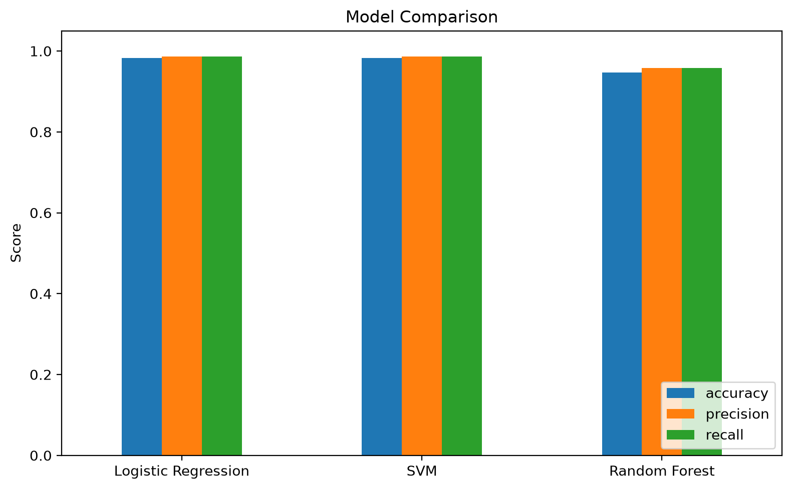
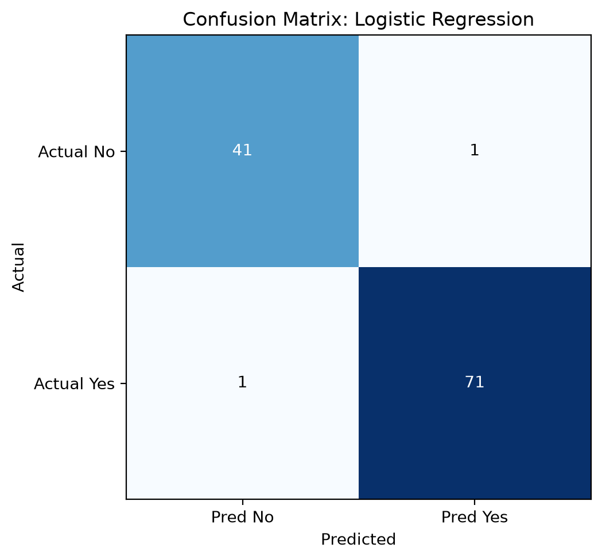
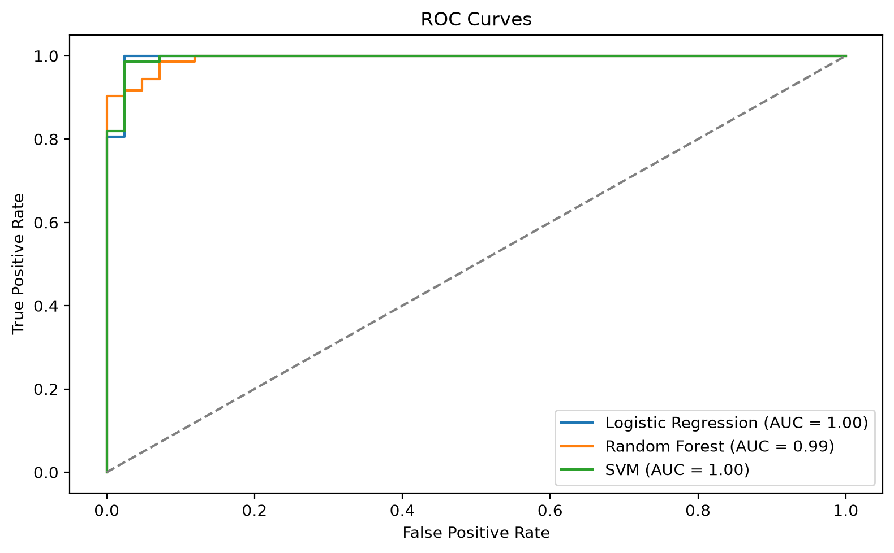
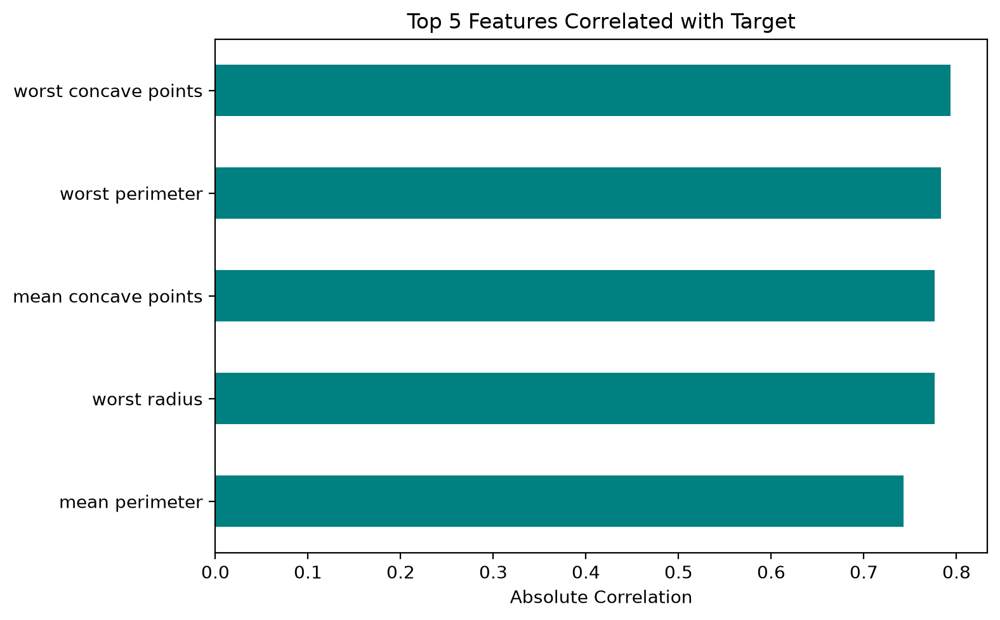
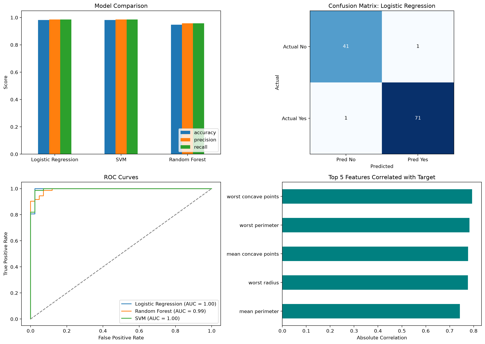

# Comparative Analysis of ML Classifiers for Medical Diagnosis

## 📌 Project Overview

This project demonstrates an end-to-end machine learning workflow for medical diagnosis using the **Breast Cancer Wisconsin (Diagnostic)** dataset from scikit-learn.

It covers data engineering, preprocessing, feature scaling, model training, and visual evaluation.

---

## 🎯 Objectives

* Convert the raw dataset into a Pandas DataFrame with proper feature names
* Check for missing values
* Scale features using StandardScaler
* Identify the top 5 features correlated with the target
* Train and compare three classifiers
* Visualize model performance with Matplotlib

---

## 📊 Dataset

The project uses the built-in scikit-learn Breast Cancer Wisconsin dataset.

The target variable indicates whether the tumor is malignant or benign.

---

## ⚙️ Technologies Used

* Python
* Pandas
* Scikit-learn
* Matplotlib

---

## 🤖 Machine Learning Model

The script trains and compares three classifiers:

* Logistic Regression
* Random Forest Classifier
* Support Vector Machine (SVM)

---

## 📈 Evaluation Metrics

The model performance is evaluated using:

* Accuracy Score
* Precision Score
* Recall Score
* Confusion Matrix
* ROC Curve (AUC)
* Correlation-based feature analysis

---

## 📊 Dashboard Visualization

A dashboard-style visualization is implemented using Matplotlib, including:

* Model comparison bar chart
* Confusion matrix heatmap for the best model
* ROC curves
* Top 5 correlated features

---

## 🚀 How to Run the Project

### 1. Clone Repository

```
git clone <your-repository-url>
cd heart-attack-prediction
```

### 2. Create Virtual Environment

```
python -m venv venv
```

### 3. Activate Environment

**Windows:**

```
venv\Scripts\activate
```

**Mac/Linux:**

```
source venv/bin/activate
```

### 4. Install Dependencies

```
pip install pandas matplotlib scikit-learn
```

### 5. Run the Project

```
python main.py
```

---

## 📌 Results

The script prints the missing-value check, top correlated features, and a comparison table for the three models. It also renders the required plots.

### Result Images











---

## 🧠 Real-World Application

This type of machine learning model can assist healthcare professionals in:

* Early detection of disease patterns
* Risk assessment of patients
* Supporting clinical decision-making

---

## 🙏 Acknowledgment

This project was completed as part of academic coursework under **ICT 6513 – AI in Healthcare**.

---

## 📧 Submission

For assignment submission, export the notebook or include the Python script together with the generated figures if needed.
