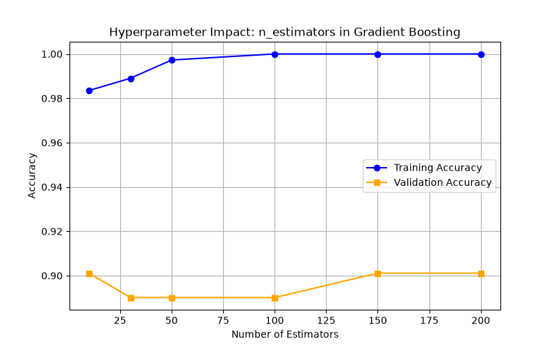
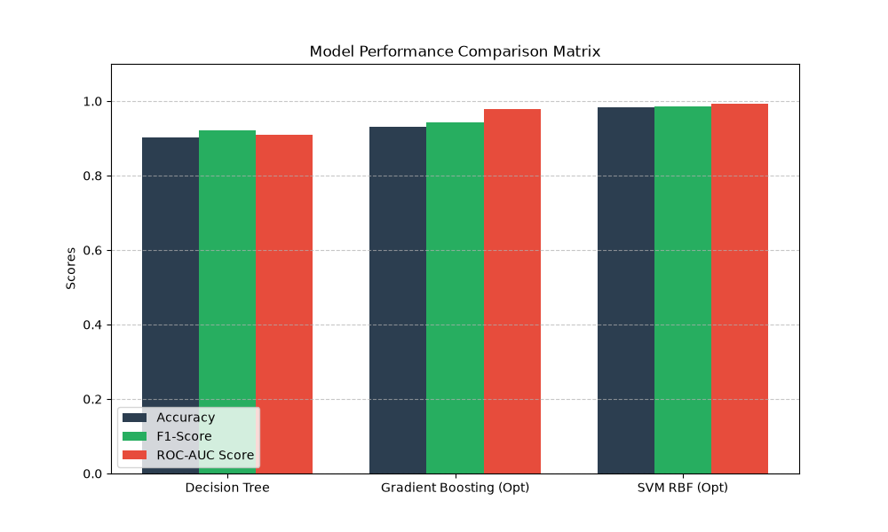
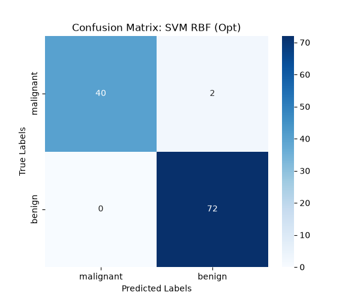

# Coding Assignment 2: Advanced Ensemble Learning and Evaluation for Cancer Prediction

This project implements an end-to-end machine learning pipeline for the Breast Cancer Wisconsin (Diagnostic) dataset using scikit-learn, pandas, matplotlib, and seaborn.

## What It Does

- Loads the dataset directly from `sklearn.datasets.load_breast_cancer`
- Converts the raw dataset into a Pandas DataFrame
- Checks for missing values and logs the result
- Selects the top 5 features by correlation with the target
- Applies `StandardScaler` to normalize the selected features
- Trains and evaluates three classifiers:
  - Decision Tree Classifier
  - Gradient Boosting Classifier with hyperparameter tuning
  - RBF SVM with hyperparameter tuning
- Generates and saves three plots:
  - Hyperparameter impact plot
  - Model comparison bar chart
  - Confusion matrix heatmap

## Files

- `main.py` - Main executable script for the assignment
- `hyperparameter_impact.png` - Training vs validation accuracy plot
- `model_comparison_matrix.png` - Accuracy, F1-score, and ROC-AUC comparison
- `confusion_matrix_best_model.png` - Confusion matrix for the best model

## Results

If the PNG files are committed to the repository, GitHub will render them below.

### Hyperparameter Impact Plot



### Model Comparison Matrix



### Confusion Matrix Heatmap



## Requirements

Install the following Python packages if they are not already available in your environment:

- numpy
- pandas
- matplotlib
- seaborn
- scikit-learn

## How to Run

From the `Task 2` folder, run:

```bash
python main.py
```

If your system uses a specific Python executable, run that executable directly instead.

## Notes

- The script saves all plots in the same folder as the script.
- The evaluation uses accuracy, F1-score, and ROC-AUC.
- The best-performing ensemble model is used for the confusion matrix heatmap.
