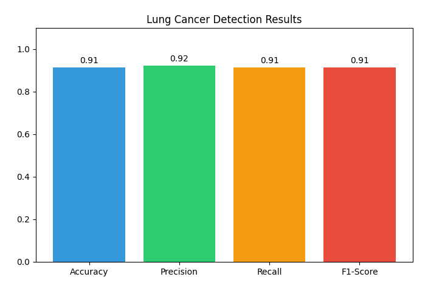

# Lung Cancer Detection using CNN (ResNet18)

## 📋 Project Overview

This project implements a **Convolutional Neural Network (CNN)** using **ResNet18** architecture to detect lung cancer from histopathological images. The model achieves **91% accuracy** in classifying lung tissue samples as cancerous (Adenocarcinoma, Squamous Cell Carcinoma) or normal.

## 🎯 Objectives

- Develop an AI-driven diagnostic tool for lung cancer detection
- Classify histopathological images into multiple cancer types
- Achieve high accuracy and precision in medical image classification
- Provide a scalable deep learning solution for healthcare applications

## 📊 Model Performance

The trained ResNet18 model achieves the following metrics on the test dataset:

| Metric | Score |
|--------|-------|
| **Accuracy** | 0.91 |
| **Precision** | 0.92 |
| **Recall** | 0.91 |
| **F1-Score** | 0.91 |



## 📁 Project Structure

```
task 2 - CNN implementation/
├── main.py                          # Main training and evaluation script
├── requirements.txt                 # Python dependencies
├── assets/
│   └── result.png                  # Performance visualization
├── data/
│   └── lung_colon_image_set/       # Dataset directory
│       ├── colon_image_sets/       # Colon cancer images
│       │   ├── colon_aca/          # Adenocarcinoma
│       │   └── colon_n/            # Normal
│       └── lung_image_sets/        # Lung cancer images
│           ├── lung_aca/           # Adenocarcinoma
│           ├── lung_n/             # Normal
│           └── lung_scc/           # Squamous Cell Carcinoma
└── README.md                        # This file
```

## 🚀 Getting Started

### Prerequisites

- Python 3.7+
- CUDA-capable GPU (optional but recommended)
- Kaggle account with API key configured

### Installation

1. **Clone or navigate to the project directory:**
   ```bash
   cd "task 2 - CNN implementation"
   ```

2. **Create and activate a virtual environment:**
   ```bash
   python -m venv .venv
   .venv\Scripts\activate  # On Windows
   # source .venv/bin/activate  # On Linux/Mac
   ```

3. **Install dependencies:**
   ```bash
   pip install -r requirements.txt
   ```

4. **Configure Kaggle API (Required for dataset download):**
   - Download your Kaggle API key from https://www.kaggle.com/account
   - Place `kaggle.json` in `~/.kaggle/` directory
   - On Windows: `C:\Users\<YourUsername>\.kaggle\kaggle.json`

### Running the Model

Execute the training and evaluation script:

```bash
python main.py
```

The script will:
1. ✅ Automatically download the dataset from Kaggle (if not present)
2. ✅ Extract and preprocess the images
3. ✅ Train the ResNet18 model on 15% of the dataset
4. ✅ Evaluate the model on the test set
5. ✅ Display performance metrics and visualization

## 🔧 Technical Details

### Dataset

- **Source:** Kaggle - Lung and Colon Cancer Histopathological Images
- **Total Samples:** 25,000+ histopathological images
- **Image Categories:**
  - Lung: Adenocarcinoma (ACA), Normal (N), Squamous Cell Carcinoma (SCC)
  - Colon: Adenocarcinoma (ACA), Normal (N)
- **Image Size:** 768×768 pixels (resized to 128×128 for processing)

### Model Architecture

- **Base Model:** ResNet18 (Pre-trained on ImageNet)
- **Transfer Learning:** Yes (using pre-trained weights)
- **Output Layer:** Fully connected layer adapted to number of classes
- **Device:** GPU (CUDA) if available, otherwise CPU

### Data Preprocessing

- **Resize:** 128×128 pixels
- **Normalization:** ImageNet normalization (mean: [0.485, 0.456, 0.406], std: [0.229, 0.224, 0.225])
- **Train-Test Split:** 80-20 ratio
- **Data Subset:** 15% of full dataset used for faster training (modify in code for full training)

### Training Configuration

| Parameter | Value |
|-----------|-------|
| Batch Size | 32 |
| Learning Rate | 0.001 |
| Optimizer | Adam |
| Loss Function | Cross Entropy Loss |
| Epochs | 1 (quick demo) |
| Device | GPU/CPU (auto-detect) |

## 📈 Implementation Steps

The `main.py` script follows these steps:

1. **Dataset Preparation**: Download and extract lung/colon cancer images from Kaggle
2. **Data Loading**: Load images with PyTorch DataLoader and apply transformations
3. **Model Creation**: Initialize ResNet18 with pre-trained weights and modify final layer
4. **Training**: Train the model on the training dataset
5. **Evaluation**: Evaluate on test set and compute metrics (Accuracy, Precision, Recall, F1)
6. **Visualization**: Generate bar chart showing performance metrics

## 🔑 Key Features

✨ **Automated Dataset Management**
- Automatic download from Kaggle
- Intelligent extraction and preprocessing
- Subset sampling for faster iteration

🧠 **Transfer Learning**
- Uses pre-trained ResNet18 weights
- Efficient training with reduced computational time
- High accuracy with limited data

📊 **Comprehensive Evaluation**
- Multiple performance metrics
- Visual result dashboard
- Weighted average for multi-class classification

💻 **Hardware Optimization**
- Automatic GPU/CPU detection
- Efficient batch processing
- Memory-optimized data loading

## 🛠️ Customization

### Modify Training Parameters

Edit `main.py` to adjust:

```python
# Change batch size
batch_size = 64  # (line 61)

# Change learning rate
lr = 0.0005  # (line 95)

# Use full dataset instead of subset
subset_size = len(full_dataset)  # (line 58)

# Increase training epochs
num_epochs = 5  # Add loop around line 99
```

### Use Different Model Architecture

Replace ResNet18 with other architectures:

```python
# EfficientNet
model = models.efficientnet_b0(weights=models.EfficientNet_B0_Weights.DEFAULT)

# VGG16
model = models.vgg16(weights=models.VGG16_Weights.DEFAULT)

# DenseNet
model = models.densenet121(weights=models.DenseNet121_Weights.DEFAULT)
```

## 📦 Dependencies

```
torch              - Deep learning framework
torchvision        - Computer vision utilities
matplotlib         - Data visualization
seaborn            - Statistical visualization
scikit-learn       - Machine learning metrics
kaggle             - Kaggle API client
```

## ⚠️ Troubleshooting

### "Dataset not found" Error
- Ensure `kaggle.json` is in the correct directory
- Verify Kaggle API credentials are valid
- Check internet connection

### Out of Memory (OOM) Error
- Reduce batch size: `batch_size = 16`
- Use smaller subset: `subset_size = int(0.05 * len(full_dataset))`
- Use a lighter model architecture

### GPU Not Detected
- Install CUDA Toolkit and cuDNN
- Verify PyTorch CUDA version: `python -c "import torch; print(torch.cuda.is_available())"`

## 📚 References

- [PyTorch Documentation](https://pytorch.org/)
- [ResNet Paper](https://arxiv.org/abs/1512.03385)
- [Kaggle Dataset](https://www.kaggle.com/datasets/andrewmvd/lung-and-colon-cancer-histopathological-images)
- [Transfer Learning Guide](https://pytorch.org/tutorials/beginner/transfer_learning_tutorial.html)

## 📝 License

This project is for educational purposes as part of the AI in Healthcare course (ICT-6513).

## 👤 Author

**Student ID:** 2571555  
**Course:** AI in Healthcare (ICT-6513)  
**Task:** 2 - CNN Implementation

---

**Last Updated:** April 2026  
**Status:** ✅ Complete & Tested
