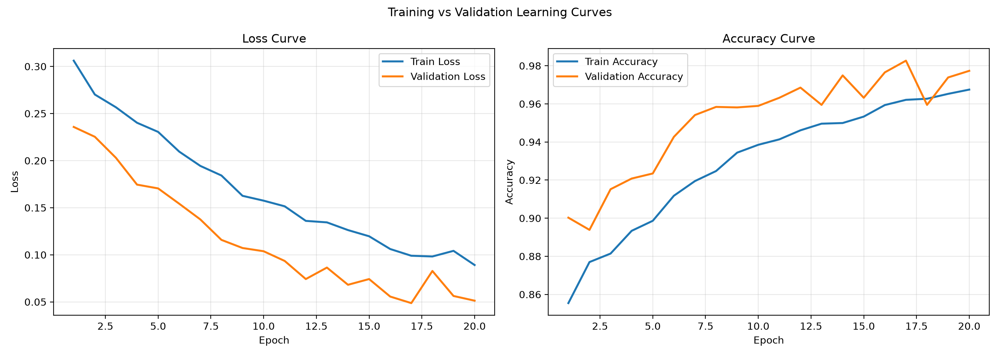
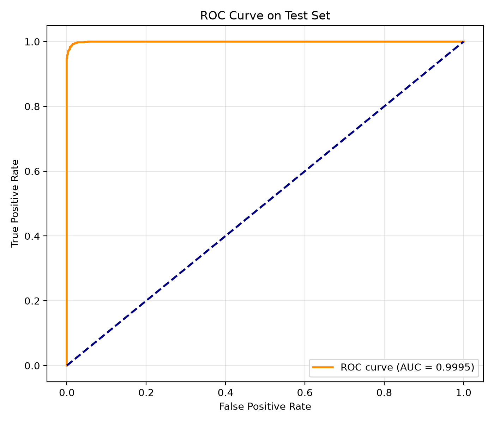
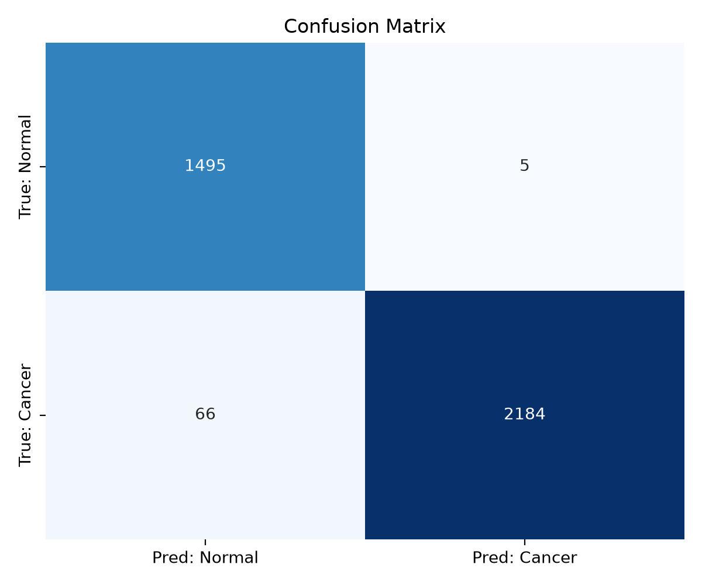

# Cancer Diagnosis with a Custom CNN

## Overview

This project implements a custom Convolutional Neural Network from scratch for binary cancer diagnosis using histopathology images. The current pipeline is aligned with the assignment requirements: custom data loading, dataset-wide normalization, stratified 70/15/15 splitting, at least 3 convolutional blocks, binary output with Sigmoid + BCELoss, and test-set diagnostics.

## Dataset

The script is configured for the Kaggle dataset `andrewmvd/lung-and-colon-cancer-histopathological-images`, which is already included in the workspace under `data/lung_colon_image_set/`. It maps the image folders into two labels:

- `0` = normal
- `1` = cancer

If the dataset is not present locally, the script can attempt a Kaggle download when the Kaggle CLI is configured.

## What the script does

The `main.py` pipeline now:

1. Loads images with a custom PyTorch `Dataset`.
2. Resizes images to `128 x 128`.
3. Applies training augmentation with flips and small rotations.
4. Computes dataset-wide mean and standard deviation for normalization.
5. Splits the data into training, validation, and testing sets using stratification.
6. Trains a custom CNN for 20 epochs with Adam and BCELoss.
7. Saves learning curves, ROC curve, and confusion matrix into `assets/`.

## Model Architecture

The CNN contains:

- 3 convolutional blocks
- Batch Normalization after each convolution
- MaxPooling after each block
- Dropout regularization
- A fully connected hidden layer
- A single sigmoid output node for binary classification

## Result Preview

GitHub will render the generated figures below directly from the `assets/` folder:







If you want a single compact preview image, you can also use `assets/result.png`.

## Running the project

```powershell
pip install -r requirements.txt
python main.py
```

If Kaggle download is needed, make sure the Kaggle API is configured on your machine.

## Requirements

The project uses:

- `torch`
- `torchvision`
- `matplotlib`
- `seaborn`
- `scikit-learn`
- `Pillow`

## Assignment status

The code now covers the core technical requirements of the assignment. The only optional enhancement not included is Grad-CAM or saliency maps; the assignment allowed either confusion matrix or saliency/Grad-CAM, and this implementation provides the confusion matrix.
